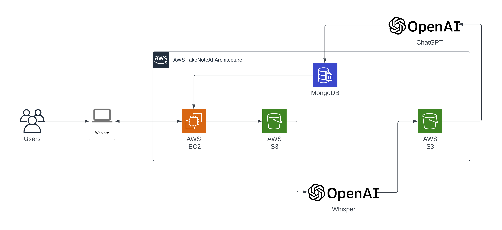

# Hackathon For Good: La Región de AWS en España al Servicio de la Sociedad

## Descripción del Proyecto

**Reto Seleccionado: Cruz Roja**

TakeNoteAI ofrece una solución innovadora que permite a Cruz Roja recopilar información de los usuarios de manera
automatizada, eliminando la necesidad de escribir datos manualmente. Esto permite que los usuarios de la organización se
enfoquen en tener conversaciones significativas y establecer relaciones efectivas con las personas afectadas. Además,
TakeNoteAI es altamente personalizable y se puede adaptar a las necesidades específicas de área de la organización

En esta sección podéis realizar una descripción más detallada de vuestra aplicación/solución, indicando el caso de uso,
los pros y contras de vuestra implementación, etc.

------

TakeNoteAI se enfoca en mejorar la eficiencia de la toma de datos en organizaciones como Cruz Roja, permitiendo a los
usuarios de la organización concentrarse en establecer relaciones efectivas con las personas afectadas.

El caso de uso se basa en el escenario en el que los colaboradores de la Cruz Roja necesitan recopilar información
de las personas afectadas, pero no quieren desviarse de su objetivo principal: brindar apoyo a las personas.

Para lograr este objetivo, utilizamos una variedad de tecnologías de AWS, incluyendo S3 para almacenar los archivos de
audio, EC2 para el servidor y OpenAi - Whisper para convertir el audio a texto, OpenAI - ChatGPT para comprender las
acciones necesarias y obtener los datos requeridos, y MongoDB para almacenar los datos obtenidos.

**Los pros de nuestra implementación son**: la automatización de la toma de datos permite que los trabajadores de Cruz
Roja se concentren en lo que realmente importa y la adaptabilidad a las necesidades específicas de cada área de la
organización.

Sin embargo, **también hay algunos contras que deben tenerse en cuenta**: la precisión de la transcripción de voz a
texto puede variar según la calidad de la grabación y la complejidad del discurso. El sistema trabaja con internet para
conectarse con los servicios por lo que puede ser un desventaja en lugares con poca conexión a internet.

## Diagrama de Arquitectura

## Descripción Técnica

Una visión general de:

La solución propuesta utiliza una arquitectura monolítica.
Nuestro servidor está alojado en AWS EC2 utilizando un ARM como procesador.

**¿Qué tipo de arquitectura habéis planteado?**

Hemos utilizado la arquitectura monolítica en nuestro proyecto. Esta elección se basó en la simplicidad y la facilidad
de implementación de este tipo de arquitectura.Además de la simplicidad y facilidad de implementación, la arquitectura
monolítica también ofrece otros beneficios en el contexto de nuestro proyecto. Al estar todos los componentes del
sistema en un solo lugar, se reduce el tiempo y la complejidad de la configuración y el mantenimiento de la
infraestructura necesaria para su operación.

**¿Qué tecnologías AWS se han utilizado?**
* AWS S3
* AWS EC2
* AWS IAM
* AWS Certificate Manager

**Posibles tecnologías AWS a futuro**
* AWS Transcribe
* AWS Comprehend

## Demo Video

Link del video en Youtube: https://youtu.be/Cd9koQjYV9c

## Team Members

* Jose Chipana Tica - josepaulct@gmail.com
* Nelson Moncada - juniormoncada17@gmail.com
 
